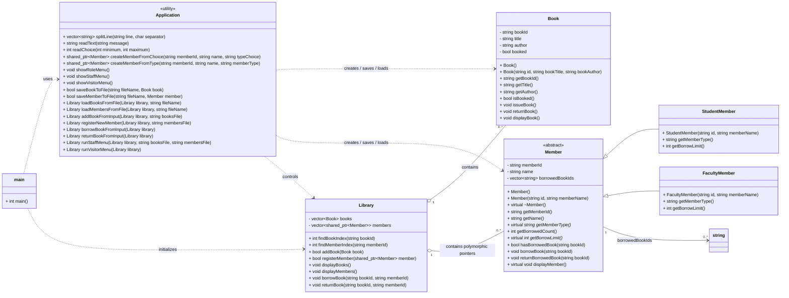

# BookVault Simple UML Diagram

## Notes

- `Book`, abstract `Member`, `StudentMember`, `FacultyMember`, and `Library` are the core domain classes.
- `Application` groups the free functions that handle menus, input, parsing, file I/O, and role-based flow.
- `Library` owns the collections of `Book` objects and polymorphic `Member` pointers, then enforces borrowing rules through virtual member behavior.
- Persistence uses `Storage/books.txt` and `Storage/members.txt`.
